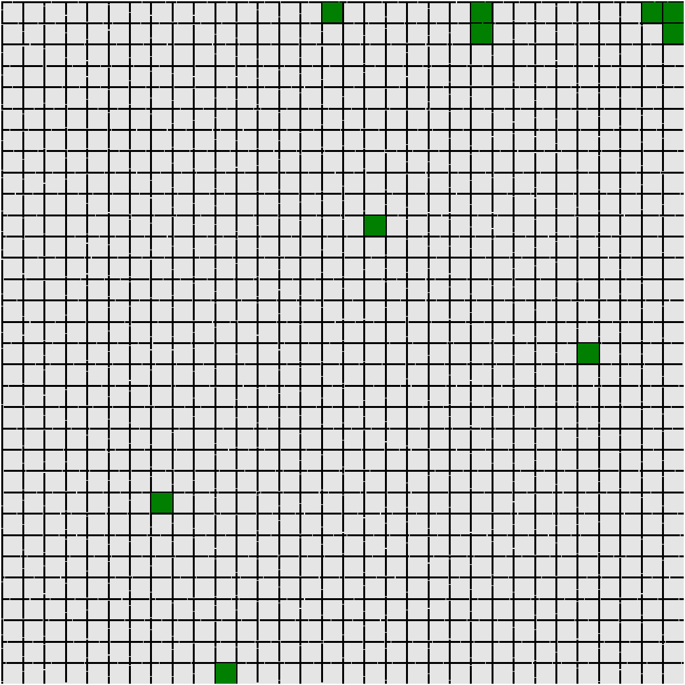
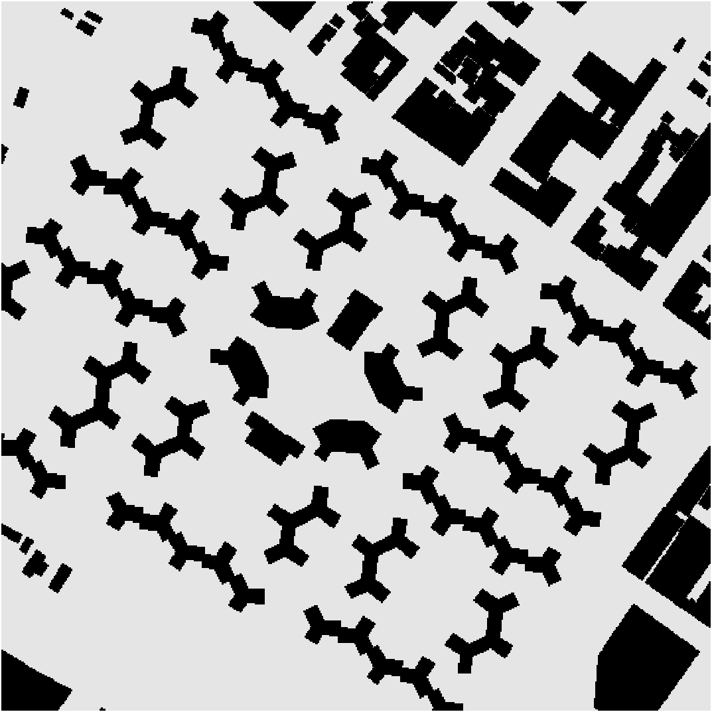
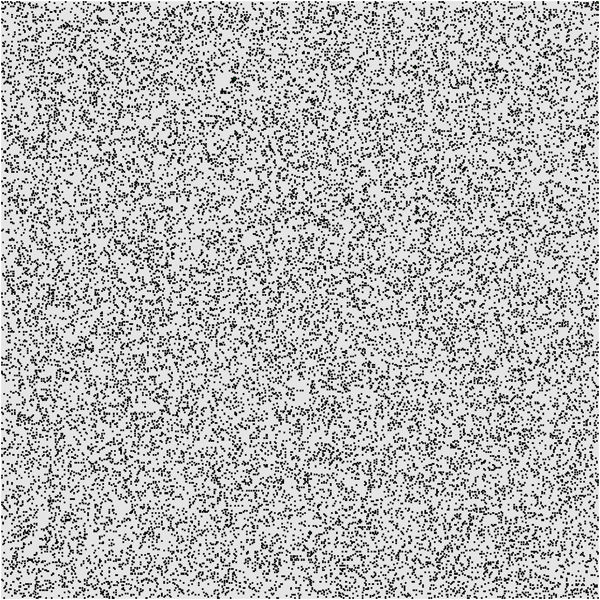
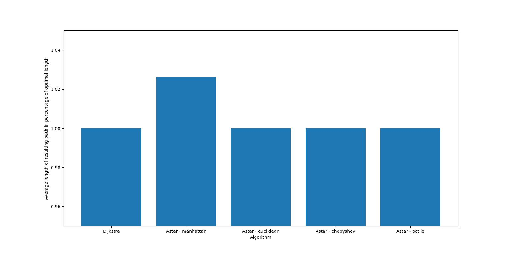
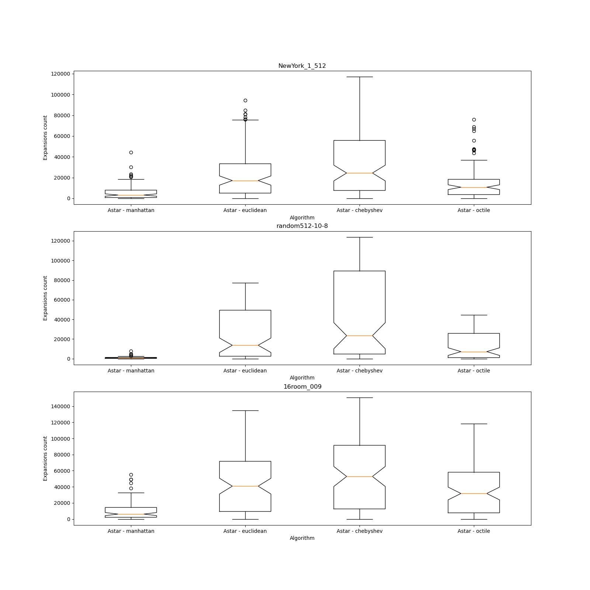
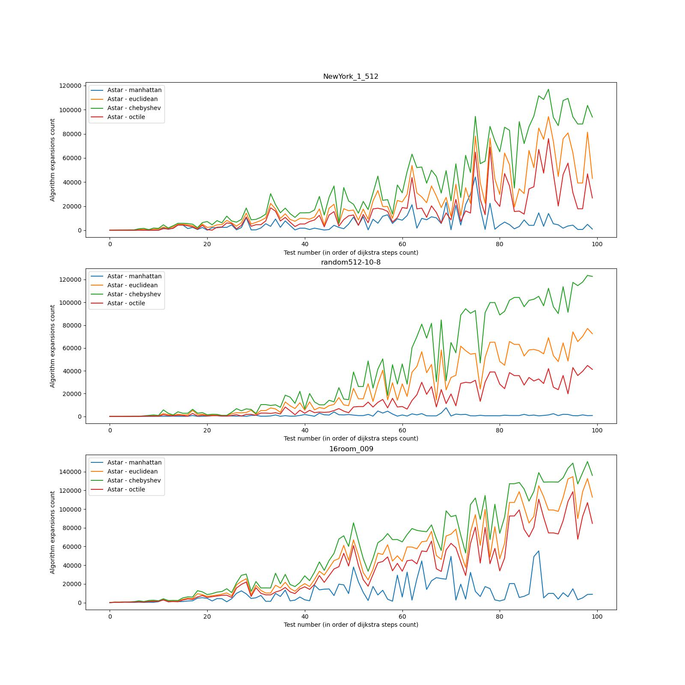

# BenchmarkingAstar

The main purpose of this notebook
is to conduct massive comparative tests of different versions of A* algorithm,
solving a planning problem on an 8-connected grid with no corner-cutting

## Algorithm

Version of the heuristic search algorithm - basic algorithm + heuristics + tie-breaking

* algorithm - classic A*
* heuristics - choosing an estimate of the distance to the goal, in this notebook - Euclidean distance, octile distance, chebyshev distance and manhattan distance
* tie-breaking - a way to select the next node to open if the heuristic value is equal

## Dataset

Benchmarking was held on the [MovingAI](https://movingai.com/benchmarks/grids.html) data collection

The testing included 3 maps from different collections with visually different topologies,
100 tasks of varying difficulty were used for each map

#### Room grid

#### New York city map

#### Random maze map

## Efficiency metrics 

The following performance indicators were monitored: 
the success of solving the task (has the algorithm found the shortest path or not),
the number of vertices expansions
and the operating time of the algorithm

## Results

Some result are presented in the following grahics

#### Correctness

#### Expansions count

#### Steps count

## Conclusion

The Astar algorithm works as expected:

- manhattan version doesn't find the optimal path, though it works much faster than the other three
- all of the euclidean, chebyshev and octile versions always find the path with optimal length
- octile version is slightly better than the chebyshev one, and chebyshev is better than euclidean in both steps count and expansions count
